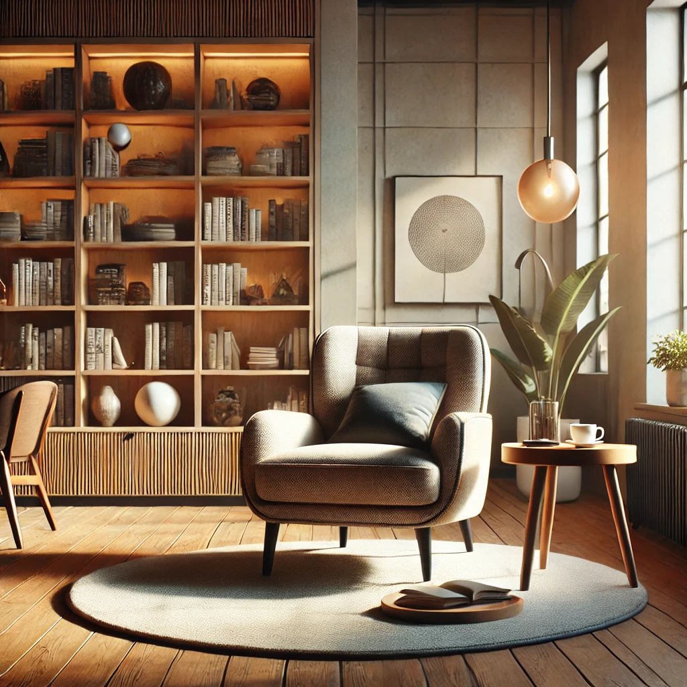
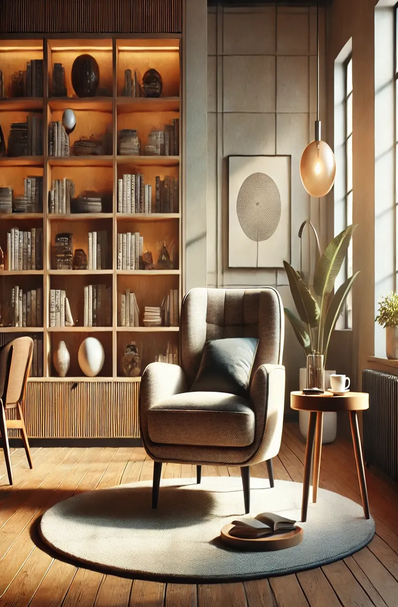
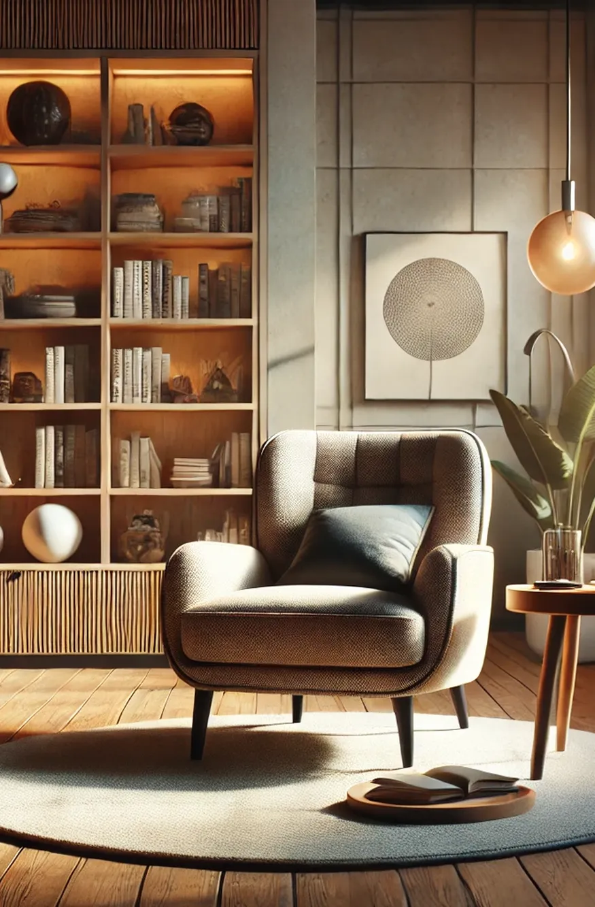

# Image Resizer & Aligner

## Overview

This Python project resizes and adapts all images inside a folder to a uniform size and proportion. It was created to solve the issue of misaligned images on websites by standardizing their dimensions. The script automatically detects the smallest image size, prompts the user for a target size, and resizes/crops all images accordingly.

## Features

- Bulk resizes images in a folder.
- Identifies the smallest image size.
- Allows users to set a target size.
- Maintains aspect ratio or crops images proportionally.
- Works with various image formats (JPG, PNG, etc.).

## Usage

1. Make sure you have **Python 3.x** installed. You can check by running:

   ```sh
   python --version
   ```

   or

   ```sh
   python3 --version
   ```

2. **Clone the repository:**

   ```sh
   git clone https://github.com/yourusername/image-resizer.git
   cd image-resizer
   ```

3. **Create a virtual environment (Recommended)**
   ```sh
   python -m venv venv
   ```
   Then activate it:
   - On **Windows**:
     ```sh
     venv\Scripts\activate
     ```
   - On **Mac/Linux**:
     ```sh
     source venv/bin/activate
     ```
4. **Install dependencies from `requirements.txt`**
   ```sh
   pip install -r requirements.txt
   ```
5. **Run the script**
   ```sh
   python main.py
   ```
6. **Follow the prompts to enter the image folder path and desired size.**

## Example

**Before:**

- Image 1: 800x600
- Image 2: 1200x900
- Image 3: 1024x768

**After setting target size to 800x600:**

- All images are resized/cropped to 800x600 or ANY SIZE YOU NEED.

## 📸 Comparison: Wrong vs. Correct Resizing

Below is an example of how images can be resized incorrectly and how this tool fixes them.

### 🖼️ Original Image

Here is the original image before resizing.  


### 🛑 Incorrect Resize (Distorted)

When resized incorrectly, images may stretch or lose proportions.  


### ✅ Correct Resize (Maintains Proportions)

This tool resizes images while keeping their proportions intact.  


## Contributing

Pull requests are welcome! If you have suggestions, feel free to open an issue or submit a PR.

## Contact

Developed by [Flávio Lins](https://www.linkedin.com/in/flavio13lins/). Feel free to reach out!
